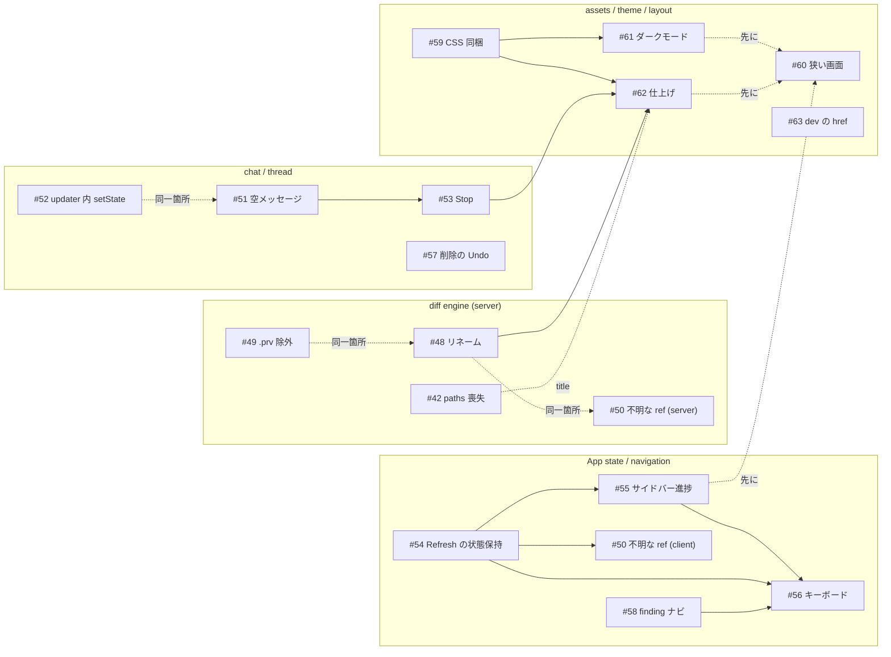

# UX レビュー（2026-09、コミット c3362cb 時点）

`prv` の UI を実際に起動し（compiled binary + Playwright、混在した変更を持つサンプルリポジトリ）、コードと突き合わせて洗い出した UX 上の改善点。優先度順に並べ、各項目に根拠（再現手順または該当コード）と修正案を添える。

検証環境: 1440×900 / 900×800 / 640×800 の 3 幅、Unified / Split、コメントスレッド、チャット、Review、File ビュー、Markdown レンダリング、ModePicker、Refresh。`claude` CLI は存在するが API に到達できない環境だったため、エージェントのターンは「返ってこない」ケースの挙動として観察している。

---

## P1 — レビュー結果の信頼性に関わるもの（バグ相当）

### 1. 純粋なリネームがパス空・「File without changes」で表示され、サイドバーにも出ない

- **再現**: `git mv a.ts b.ts` のみ（内容変更なし）→ カードのパスが空文字、本文が diff2html の "File without changes"、ファイルツリーに項目が無い。トップバーの「N changed」には数えられる。
- **原因**: `src/diff/engine.ts` の `parseFileSection` が `---` / `+++` ヘッダーからパスを取るが、similarity 100% のリネームにはそれが無い（`rename from` / `rename to` のみ）。`Status` 型には `"renamed"` があるが、`computeStatus` は決して返さない。`styles.css` の `.file-card-renamed` も未使用。
- **修正案**: `rename from` / `rename to`（および `copy from/to`）を解析して `status: "renamed"`, `path: <new>`, `oldPath: <old>` を返す。カードヘッダとツリーに `old → new` を表示し、`StatusIcon` の `renamed` を実際に使う。`/api/file` の old 側取得も `oldPath` を使うようにする。

### 2. `.prv/comments.json` が差分に「added」として現れる

- **再現**: コメントを 1 つ書く → 次の Refresh で `.prv/comments.json` が追加ファイルとして並び、「7 changed +7」が「8 changed +38」になる。Review を走らせるとエージェントにもこのファイルが渡る。
- **原因**: `rawUntrackedDiffs`（`src/diff/engine.ts`）が untracked を全部列挙する。`src/diff/files.ts` の `SKIPPED_DIRS` は files モードにしか効かない。
- **修正案**: untracked 列挙から `.prv/` を除外する（最小）。加えて初回書き込み時に `.git/info/exclude` へ `.prv/` を追記すれば、ユーザーの `git status` も汚さない。

### 3. 存在しない ref を指定しても何も言われない

- **再現**: ModePicker の検索欄に `does-not-exist` と打ち「Use … as ref」を選ぶ → エラーなし、「No changes to review.」（untracked があればそれだけ表示）。API 直叩きでも同じ（`/api/diff?...&leftRef=does-not-exist` が untracked だけの配列を返す）。
- **原因**: `computeRawDiff` が `.nothrow()` で git の失敗を握りつぶし、stdout 空を「差分なし」として返す。
- **修正案**: `exitCode !== 0` なら 400 と stderr を返す。UI 側はエラーバナーを出し、ピッカーの値を直前の有効なモードに戻す。

### 4. 返答が来なかったターンの空メッセージが永続化される

- **再現**: スレッドで送信 → 応答が来ないままリロード → `.prv/comments.json` に `{"role":"assistant","text":""}` が残り、以後そのスレッドに空の吹き出しが出続ける（実測でユーザー発言 1 件につき空アシスタント 1 件が保存されていた）。
- **原因**: `useDiffChat` の `stripEphemeral` は `tool` / `progress` を落とすが、text が空の `assistant` プレースホルダは残す。`dropEmptyPlaceholder` は `done` フレーム時にしか呼ばれない。
- **修正案**: 永続化境界（`stripEphemeral`）で空の assistant を落とす。読み込み側（`CommentThread` の初期 messages）でも同様に除外して既存データを救う。

### 5. 描画中に親の state を更新している（React 警告）

- **再現**: スレッドで送信するとコンソールに `Cannot update a component (App) while rendering a different component (CommentThread)`。
- **原因**: `useDiffChat` の `commit` が `setMessages` の updater 内から `onChange`（→ `useComments.mutate` → App の `setComments`）を呼ぶ。StrictMode では updater が 2 回走るため PUT も 2 回になり得る。
- **修正案**: `onChange` は `useEffect(() => onChange(stripEphemeral(messages)), [messages])` で呼ぶ。

### 6. （既知 #42）`prv <path>` のスコープが UI で失われる

- `src/shared/modeQuery.ts` の `encodeMode` は git モードの `paths` を書かない。現行コードでも未修正であることを確認した。修正方針は issue の通り。

---

## P2 — レビューの流れを止めるもの

### 7. エージェントのターンを止められない・待ち時間が見えない

- **観察**: Review には「Stop (n/3)」があるが、チャットとスレッドには無い。CLI が固まると「thinking…」のまま永遠に待ち、Send も Apply も disabled のまま。タイムアウトも経過時間も無い。「New chat」は接続を閉じるので実質 Stop だが、会話も消える。
- **修正案**: 送信中は Send を Stop に切り替える（Review と同じく WebSocket close で子プロセスを kill する仕組みが `server.ts` に既にある）。30 秒ほど応答が無ければ「まだ応答がありません — CLI のログイン状態を確認してください」を添える。

### 8. Refresh（＝Apply with agent 完了時）で読んでいた場所と状態が全部飛ぶ

- **実測**: Refresh 前後で `scrollY 832 → 0`、Viewed `true → false`、File タブ `File → Diff`、展開したコンテキストも消える。Apply 完了時に `onApplied` → Refresh が自動で走るので、修正を当てた直後に見失う。
- **原因**: `App.tsx` の diff 読み込み effect が冒頭で `setFiles(null)` するため、全 `DiffPanel` が unmount される。Viewed / expanded / view / reveals は各カードの `useState`。
- **修正案**: 読み込み中も旧 `files` を保持して差し替える（ローディングはトップバーのスピナーで示す）。Viewed・折りたたみ・表示モードは path をキーに App 側（または `localStorage` に mode をキーとして）へ持ち上げ、リロードでも残す。

### 9. サイドバーが「今どこを読んでいるか」「何が残っているか」を示さない

- **観察**: スクロールしても active 項目が追従しない（クリック時にしか更新されない。File ビューで util.ts を読んでいてもツリーは README.md がハイライト）。各ファイルの +/- 数、Viewed 済み、コメント件数がツリーに出ない。トップバーにも「Viewed 3/8」「open comments 4」といった進捗が無い。
- **修正案**: `IntersectionObserver` で scroll-spy。ツリー各行の右端に diffstat とコメント数バッジ、Viewed 済みは薄く表示。トップバーに Viewed 進捗と未解決コメント数。

### 10. キーボードだけではコメントを付けられない・移動もできない

- **観察**: 「+」は `onMouseOver` でしか描画されず、行番号セルはフォーカスできない（gutter 内の focusable 要素 0）。j/k、n/p、`?` などのショートカットは無い。Tab で辿ると各ハンク展開ボタンが全部止まる。
- **修正案**: 行番号セルにフォーカス可能なボタンを置き `c` でコメント開始。`]` / `[` で次/前のファイル、`n` / `p` で次/前のコメント、`v` で Viewed、`x` で折りたたみ、`?` でヘルプ。IME 中は無効化（`isSubmitKey` と同じガード）。

### 11. コメント削除（×）が即時・確認なし・取り消し不可

- エージェントとの会話ごと消える。**修正案**: 確認ダイアログ、または数秒間の Undo トースト。

### 12. Review の finding を横断的に辿れない

- `ReviewPanel` は件数を出すだけ。severity / lens で絞る、次の finding へジャンプする手段が無い。**修正案**: パネル内に severity 別カウント（クリックでそこへスクロール）と「Next finding」。

---

## P3 — 環境・堅牢性・仕上げ

### 13. CSS を CDN（jsdelivr）から読んでいる

- `src/ui/index.html` が diff2html と highlight.js の CSS を CDN から取る。オフライン・社内プロキシ環境では diff が素の `<table>` になる（本検証環境でも実際にブロックされた）。同じファイルは `node_modules` にあるので bundle に同梱すべき。ローカルツールがネットワークに依存する理由が無い。

### 14. 狭い画面で破綻する

- 900px: Markdown の「1 change in this file — see them in Source」が縦一列に折り返し、チャット（min 280）+ サイドバー（296）でメイン列が約 190px。640px: トップバーの統計が「prv」ロゴに重なる。
- **修正案**: 約 1000px 以下ではサイドバーをオーバーレイ、チャットをドロワーにし、統計を省略する。`md-view-note` は `white-space: nowrap` + 省略。

### 15. ダークモードが無い

- `color-scheme: light` 固定。トークン化は済んでいるが `#eaeef2` などの直書きが数箇所（`.tree-row.file.active`、`.d2h-info` の `#ddf4ff`）。`prefers-color-scheme: dark` 対応は比較的安価。

### 16. タブタイトルが常に「prv」、favicon が 404

- 複数のリポ／比較を同時に開くと区別できない。**修正案**: `<repo名>: HEAD ↔ Working tree` をタイトルに、favicon を同梱。

### 17. 長いパスがファイル名側から省略される

- `.file-card-path` は末尾省略なので、深いパスではファイル名が消える。先頭省略（`direction: rtl` + `text-align: left`）か、ディレクトリ部分だけ薄くして省略。

### 18. チャットの設定行が折り返して Send が押しつぶされる

- 380px のパネルで AGENT / MODEL が 1 行目、EFFORT が 2 行目に落ち、Send が右下に孤立する。設定をアイコン 1 つのポップオーバーにまとめるか、ラベルを省略する。

### 19. ソースから別ディレクトリで起動するとバンドル CSS の href が壊れる

- `cd other-repo && bun /path/to/prv/src/cli.ts` で `<link href="/../../../../tmp/...chunk.css">` になり無スタイルで表示される（compiled binary では起きない）。dev ワークフロー限定だが `bun run dev` で他リポを見られない。

---

## 良かった点（維持したい）

- Enter 送信の IME ガード（`isSubmitKey`）。日本語入力での誤送信が無い。
- ハンク境界の展開ボタン、行範囲ドラッグ選択、Unified / Split 切替をまたいでスレッドが生き残る設計。
- File ビューのガター（追加・置換・削除の痕跡）と「次の変更へ」ナビ。Markdown は rendered をデフォルトにしつつ変更箇所へ誘導している。
- Review の Stop と進捗表示、findings が通常のスレッドとして扱える点。

## 着手順の提案

1. **#1, #2, #4, #5** — いずれも小さな変更で、レビュー結果の正しさに直結する。
2. **#7, #8** — 「止められない」「場所を見失う」はエージェント連携を使うほど頻繁に当たる。
3. **#9, #10** — サイドバーの状態表示とキーボード操作。GitHub の PR 画面に慣れたユーザーが最初に探すもの。
4. **#13** — オフライン耐性。1 行の変更で済む。
5. 残りは順不同。

---

## Issue 間の依存関係

上記の項目は GitHub issue #48〜#63 として起票済み（#6 は既存の #42）。対応表:

| 項目                  | issue |     | 項目            | issue |
| --------------------- | ----- | --- | --------------- | ----- |
| 1 リネーム            | #48   |     | 10 キーボード   | #56   |
| 2 `.prv` 混入         | #49   |     | 11 削除の Undo  | #57   |
| 3 不明な ref          | #50   |     | 12 finding ナビ | #58   |
| 4 空メッセージ永続化  | #51   |     | 13 CDN CSS      | #59   |
| 5 updater 内 setState | #52   |     | 14 狭い画面     | #60   |
| 6 paths 喪失          | #42   |     | 15 ダークモード | #61   |
| 7 Stop                | #53   |     | 16–18 仕上げ    | #62   |
| 8 Refresh の状態保持  | #54   |     | 19 dev の href  | #63   |
| 9 サイドバー進捗      | #55   |     |                 |       |

依存は 2 種類に分けている。**ブロック**（先行 issue の成果物が無いと実装できない、または実装がほぼ丸ごと無駄になる）と、**同一箇所**（同じファイル・同じ state を触るので、並行すると衝突するか二度手間になる）。

### ブロック関係

| 後続                                     | 先行 | 理由                                                                                                                    |
| ---------------------------------------- | ---- | ----------------------------------------------------------------------------------------------------------------------- |
| #55 サイドバーの Viewed 表示             | #54  | Viewed は各 `DiffPanel` の `useState`。#54 で App（または localStorage）に持ち上げないとツリーから読めない              |
| #56 `v`（Viewed）/ `x`（折りたたみ）     | #54  | 同上。グローバルなキーハンドラから触れる state が必要                                                                   |
| #56 `]` / `[`（次/前のファイル）         | #55  | 「今のファイル」= `activePath` はクリック時しか更新されない。scroll-spy が無いと基準がずれる                            |
| #56 `n` / `p`（次/前のコメント）         | #58  | 「次の open コメントへジャンプ」の関数を #58 で作り、#56 はキーを結びつけるだけにする                                   |
| #53 Stop 後のプレースホルダ除去          | #51  | Stop はターンを `done` 無しで終える。#51 の `stripEphemeral` 修正が無いと空メッセージが残る                             |
| #61 hljs のダークテーマ切替              | #59  | テーマ CSS を bundle しないとメディアクエリで 2 テーマを切り替えられない                                                |
| #62 favicon                              | #59  | 静的アセットを bundle する仕組みを #59 で決める                                                                         |
| #62 パス表示の省略                       | #48  | #48 でヘッダのパスが `old → new` 表示に変わる。省略ロジックはその後に                                                   |
| #62 チャット設定行                       | #53  | #53 が composer に Stop ボタンを足す。レイアウト変更はそれを含めて 1 回で                                               |
| #50 のクライアント側（直前モードへ戻す） | #54  | 「読み込み中も旧 `files` を保持する」構造がそのまま「失敗時は旧モードに戻す」の土台になる。サーバ側（400 を返す）は独立 |

### 同一箇所（並行させず順番に）

- **`src/diff/engine.ts`**: #49 → #48 → #50（サーバ側）。論理的な依存は無いが `computeRawDiff` / `parseFileSection` を全部が触る。小さい順に。
- **`src/ui/useDiffChat.ts`**: #52 → #51 → #53。#52 が永続化の呼び出し位置を変え、#51 がその関数の中身を変え、#53 が Stop を足す。3 つを 1 PR にしてもよい。
- **`src/ui/App.tsx` の diff 読み込み effect**: #54 と #50（クライアント側）。#54 に含めるのが自然。
- **`FileTree` と `.sidebar`**: #55（行の内容）→ #60（ドロワー化）。ドロワーは最終形のツリーを包む。
- **チャット composer**: #53 → #62 → #60（ドロワー化）。
- **`src/shared/modeQuery.ts`**: #42 単独。ただし #62 のタブタイトルは mode から組むので、`paths` を含めるなら #42 が先（そうでないと `prv <file>` のタイトルがスコープを示せない）。
- **#61 ダークモードの位置**: 後回しにすると #55 のバッジ、#58 のチップ、#56 のヘルプ、#57 のトーストを後から全部塗り直すことになる。#59 の直後に入れ、以降の UI 追加は必ずトークンを使う、が二度手間が最少。
- **#63** は dev ワークフロー限定で他と依存無し。ただし #59 が CSS を JS import に変えると同じアセット経路を通るので、#59 の動作確認は別ディレクトリからの `bun run dev` でも行う。
- **#57**（削除の Undo）は `useComments` だけで完結。どこに入れてもよい。

### 依存グラフ

実線 = ブロック、点線 = 同一箇所（順番の推奨）。

### 推奨する着手順（トラック別に並行可）

| 順   | engine     | chat / thread | App state / nav     | assets / theme        |
| ---- | ---------- | ------------- | ------------------- | --------------------- |
| 1    | #49        | #52 + #51     | #54（+ #50 client） | #59                   |
| 2    | #48        | #53           | #55                 | #61                   |
| 3    | #50 server | #57           | #58                 | #62（#48 / #53 待ち） |
| 4    | #42        |               | #56                 | #60（#55 / #62 待ち） |
| 随時 |            |               |                     | #63                   |

4 トラックは互いにほぼ独立なので、1 列目を同時に始められる。最後に残るのは #56 と #60 で、どちらも他の成果物を束ねる性質のもの。
